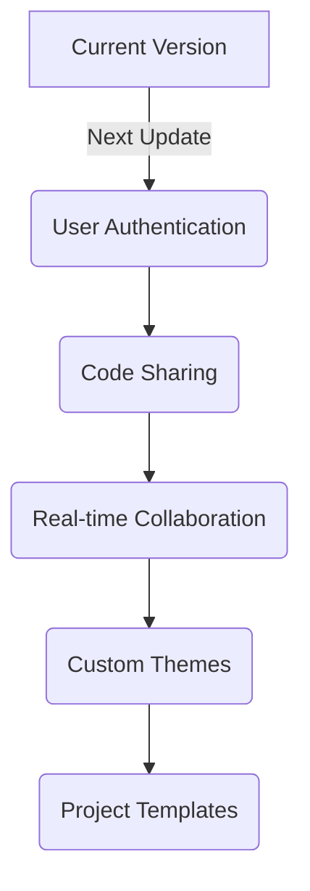

# <div align="center">🌌 CODE-VERSE</div>

<div align="center">

[](LICENSE)
[](https://www.python.org/)
[](https://github.com/abhi-1408-shek/CODE-VERSE)

<br>


</div>

---

<div align="center">

### 🎯 Transform Your Coding Experience

</div>

## 🌟 Features

<table align="center">
<tr>
<td align="center">
🎨
<br>Custom Themes
</td>
<td align="center">
🌐
<br>Multi-Language Support
</td>
<td align="center">
💻
<br>Modern Interface
</td>
</tr>
<tr>
<td align="center">
🧩
<br>Code Templates
</td>
<td align="center">
📱
<br>Responsive Design
</td>
</tr>
</table>

## ⚡ Tech Stack

<div align="center">

### Frontend


### Backend


</div>

## 🚀 Quick Start

### Prerequisites

```bash
# Check your environment
python --version    # Python 3.7+
java --version     # For Java support
g++ --version      # For C++ support
```

### 🔥 Installation

<details>
<summary>Click to expand installation steps</summary>

```bash
# Clone the repository
git clone https://github.com/abhi-1408-shek/CODE-VERSE.git
cd CODE-VERSE

# Install dependencies
pip install -r requirements.txt

# Start the server
python backend/app.py

# Open index.html in your browser
# Start coding! 🎉
```

</details>

## 💫 Key Features

<div align="center">

| Feature | Description |
|---------|-------------|
| 🎨 **Modern Editor** | Syntax highlighting, auto-indentation, line numbers |
| ⚡ **Fast Execution** | Secure sandboxed environment for multiple languages |
| 🔍 **Smart Analysis** | Real-time error detection and suggestions |
| 🌈 **Beautiful UI** | Glass-morphism effects with neon accents |

</div>

## 🗺️ Future Roadmap

<div align="center">



</div>

## 🤝 Contributing

<div align="center">

[](http://makeapullrequest.com)

</div>

1. 🔱 Fork the Project
2. 🌿 Create your Feature Branch
3. 💫 Commit your Changes
4. 🚀 Push to the Branch
5. 🎯 Open a Pull Request

## 📝 License

<div align="center">

[](LICENSE)

</div>

## 🌐 Connect With Me

<div align="center">

[](https://www.linkedin.com/in/abhishek-sharma-gcet/)
[](https://github.com/abhi-1408-shek/CODE-VERSE)

</div>

---

<div align="center">


 Made with passion by Abhishek

</div>
