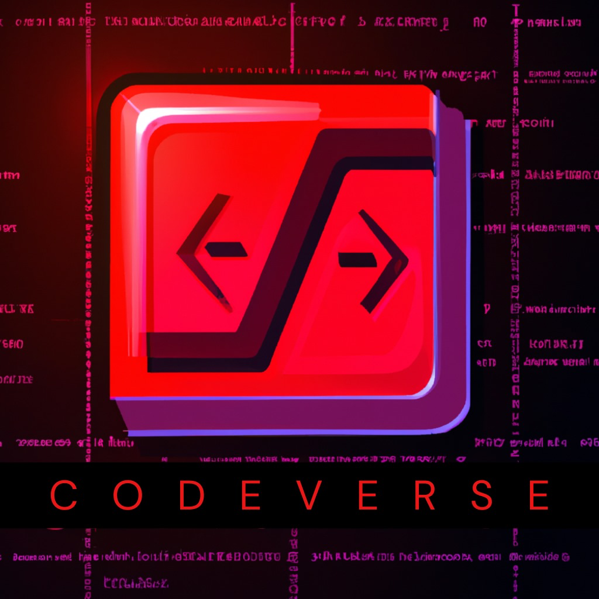

# 🚀 CODE-VERSE

<div align="center">




### Your Next-Gen Online Code Editor with Real-Time Error Detection

</div>

## ✨ Features

- 🎯 **Real-time Error Detection** - Instant feedback on your code
- 🌈 **Multi-Language Support** - JavaScript, Python, Java, C++, and HTML
- 💻 **Modern UI/UX** - Sleek design with neon aesthetics
- 🔍 **Smart Code Analysis** - Advanced error checking and suggestions
- ⚡ **Fast Execution** - Quick code compilation and results
- 🎨 **Syntax Highlighting** - Beautiful code formatting
- 📱 **Responsive Design** - Works on desktop and mobile devices

## 🛠️ Built With

- **Frontend:**
  - HTML5 & CSS3
  - Vanilla JavaScript
  - CodeMirror Editor
  - Modern Glass-morphism Design
  
- **Backend:**
  - Python Flask
  - Language-specific Compilers
  - RESTful API Architecture

## 🚀 Getting Started

### Prerequisites

Make sure you have the following installed:
- Python 3.7+
- Required language compilers:
  ```bash
  # For Java
  java --version
  
  # For C++
  g++ --version
  
  # For Python
  python3 --version
  ```

### Installation

1. **Clone the repository**
   ```bash
   git clone https://github.com/abhi-1408-shek/CODE-VERSE.git
   cd CODE-VERSE
   ```

2. **Install Python dependencies**
   ```bash
   pip install -r requirements.txt
   ```

3. **Start the backend server**
   ```bash
   python backend/app.py
   ```

4. **Open the application**
   - Open `index.html` in your browser
   - Start coding! 🎉

## 🌟 Key Features

### Code Editor
- Syntax highlighting
- Line numbers
- Auto-indentation
- Multiple language modes
- Real-time error detection

### Code Execution
- Secure sandboxed environment
- Support for multiple languages
- Quick compilation and execution
- Detailed error reporting

### Modern Design
- Neon-themed interface
- Responsive layout
- Glass-morphism effects
- Intuitive controls

## 🗺️ Roadmap

- [ ] User authentication
- [ ] Code sharing functionality
- [ ] Additional language support
- [ ] Real-time collaboration
- [ ] Project templates
- [ ] Custom themes

## 🤝 Contributing

1. Fork the Project
2. Create your Feature Branch (`git checkout -b feature/AmazingFeature`)
3. Commit your Changes (`git commit -m 'Add some AmazingFeature'`)
4. Push to the Branch (`git push origin feature/AmazingFeature`)
5. Open a Pull Request

## 📝 License

Distributed under the MIT License. See `LICENSE` for more information.

## 👥 Contact

Abhishek - [@your_twitter](https://twitter.com/your_twitter)

Project Link: [https://github.com/abhi-1408-shek/CODE-VERSE](https://github.com/abhi-1408-shek/CODE-VERSE)

---

<div align="center">
Made with ❤️ by Abhishek
</div>
